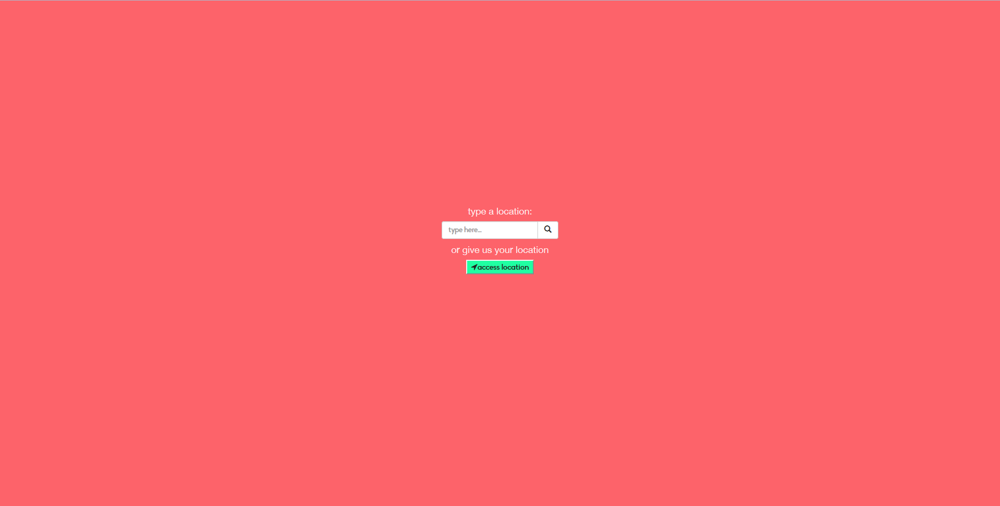
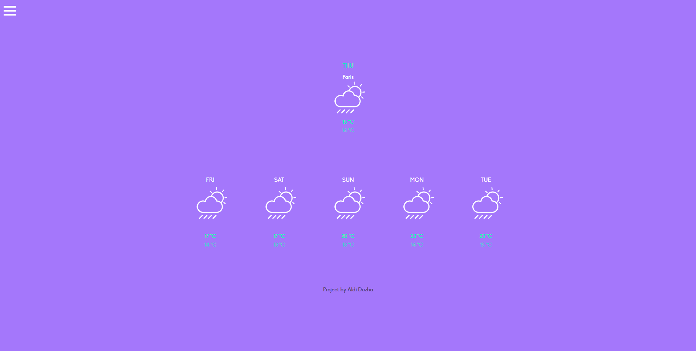
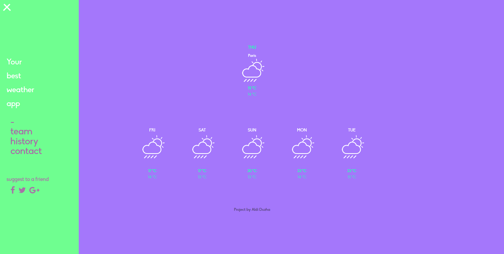

<h1>Local Weather Forecast</h1>
<h4>Shows the 5 day weather forecast of your current city or any city you like.</h4>

<h2> Features: </h2>
- 5 day weather forecast 
- 2 weather search options to choose 
- Simple and Responsive UI. 
- Slide menu for info.(editable) 
- Customised weather icons.(editable) 
- Custom preloader.(editable) 

<h3> Start Screen </h3>

<h3> Result for "Paris" input. </h3>

<h3> Slide Menu with info </h3>

<h2> PREVIEW </h2>
 

<h4>1. Download
<a href="https://github.com/aldiduzha/local-weather/archive/master.zip" target="_blank">here!
</a></h4>
<h4>2. Click index.html to open the web app. </h4>
<h4>3. Done!</h4>

<h2>License</h2>

Licensed under [MIT](LICENSE) by [aldiduzha](http://aldiduzha.com).
